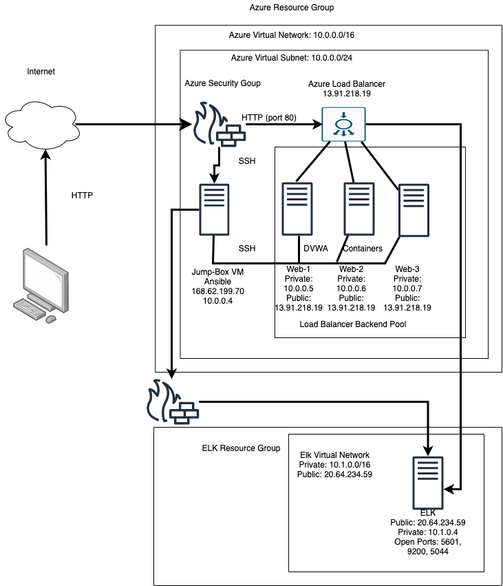
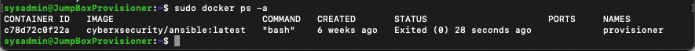

## Automated ELK Stack Deployment

The files in this repository were used to configure the network depicted below.

These files have been tested and used to generate a live ELK deployment on Azure. They can be used to either recreate the entire deployment pictured above. Alternatively, select portions of the elk-playbook.yml file may be used to install only certain pieces of it, such as Filebeat.

[elk-playbook](elk-playbook.yml)

This document contains the following details:
- Description of the Topologu
- Access Policies
- ELK Configuration
  - Beats in Use
  - Machines Being Monitored
- How to Use the Ansible Build

### Description of the Topology

The main purpose of this network is to expose a load-balanced and monitored instance of DVWA, the D*mn Vulnerable Web Application.

Load balancing ensures that the application will be highly _____, in addition to restricting _____ to the network.
- _TODO: What aspect of security do load balancers protect? What is the advantage of a jump box?_

Integrating an ELK server allows users to easily monitor the vulnerable VMs for changes to the _____ and system _____.
- _TODO: What does Filebeat watch for?_
- _TODO: What does Metricbeat record?_

The configuration details of each machine may be found below.

| Name     | Function | IP Address | Operating System |
|----------|----------|------------|------------------|
| Jump Box | Gateway  | 10.0.0.4   | Linux            |
| DVWA-1   | Web App  | 10.0.0.5   | Linux            |
| DVWA-2   | Web App  | 10.0.0.6   | Linux            |
| DVWA-3   | Web App  | 10.0.0.7   | Linux            |
| Elk Server | Log Server | 10.1.0.4 | Linux          |

### Access Policies

The machines on the internal network are not exposed to the public Internet. 

Only the load balanacer machine can accept connections from the Internet. Access to this machine is only allowed from the following IP address:

- 13.91.218.19

Machines within the network can only be accessed by the Jumpbox Provisioner.
- Public: 168.62.199.70
- Private: 10.0.0.4

A summary of the access policies in place can be found in the table below.

| Name     | Publicly Accessible | Allowed IP Addresses |
|----------|---------------------|----------------------|
| Jump Box | Yes/No              | 10.0.0.4   |
| Load Balancer |  Yes           | 13.91.218.19         |
| DVWA-1   |  No                 | 10.0.0.5             |
| DVWA-2   |  No                 | 10.0.0.6             |
| DVWA-3   |  No                 | 10.0.0.7             |
| ELK Server | No                | Public: 20.64.234.59 Private: 10.1.0.4 | 

### Elk Configuration

Ansible was used to automate configuration of the ELK machine. No configuration was performed manually, which is advantageous because...
- instead of going from the jump box and then ssh into every machine on the network, one program can be run from the jump box. It will install and configure all of the necessary machines. It allows for full automation of a specific server and reduces configuration errors.

The playbook implements the following tasks:
- The install-elk.yml file first installs docker
- 2. Installs a python package manager called pip
- 3. Installs a Docker python module
- 4. Expands the virtual memory of the Elk Server (essentially gives the server more ram to handle processing)
- 5. Download and launch the docker web container

The following screenshot displays the result of running `docker ps` after successfully configuring the ELK instance.

### Target Machines & Beats
This ELK server is configured to monitor the following machines:
- 10.1.0.4

We have installed the following Beats on these machines:
- Filebeat

These Beats allow us to collect the following information from each machine:
- Filebeat is currently being used to track users who are running sudo commands, syslogs, SSH logins, and whenever new users and groups are created.

### Using the Playbook
In order to use the playbook, you will need to have an Ansible control node already configured. Assuming you have such a control node provisioned: 

SSH into the control node and follow the steps below:
- Copy the _____ file to _____.
- Update the _____ file to include...
- Run the playbook, and navigate to ____ to check that the installation worked as expected.

_TODO: Answer the following questions to fill in the blanks:_
- _Which file is the playbook? Where do you copy it?_
- _Which file do you update to make Ansible run the playbook on a specific machine? How do I specify which machine to install the ELK server on versus which to install Filebeat on?_
- _Which URL do you navigate to in order to check that the ELK server is running?

_As a **Bonus**, provide the specific commands the user will need to run to download the playbook, update the files, etc._
